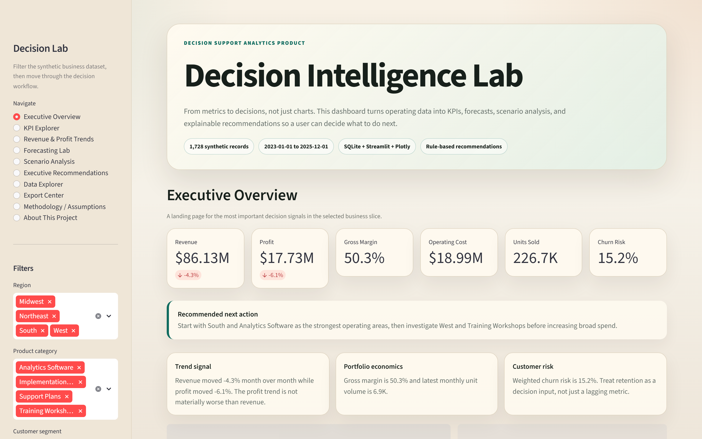
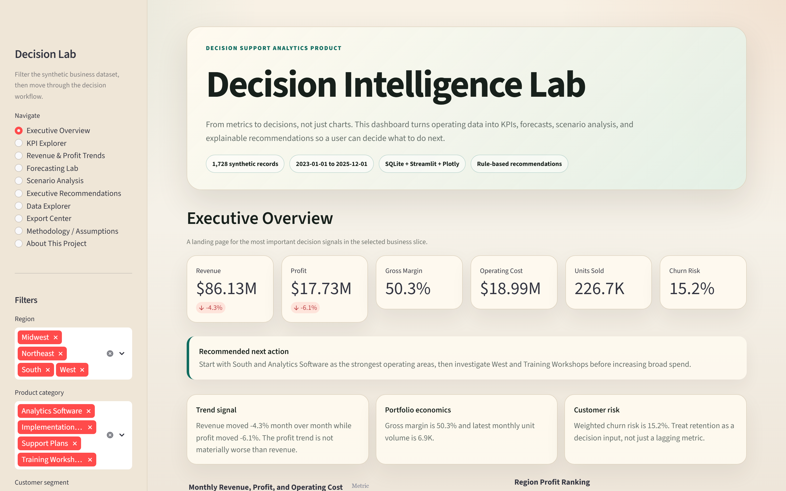
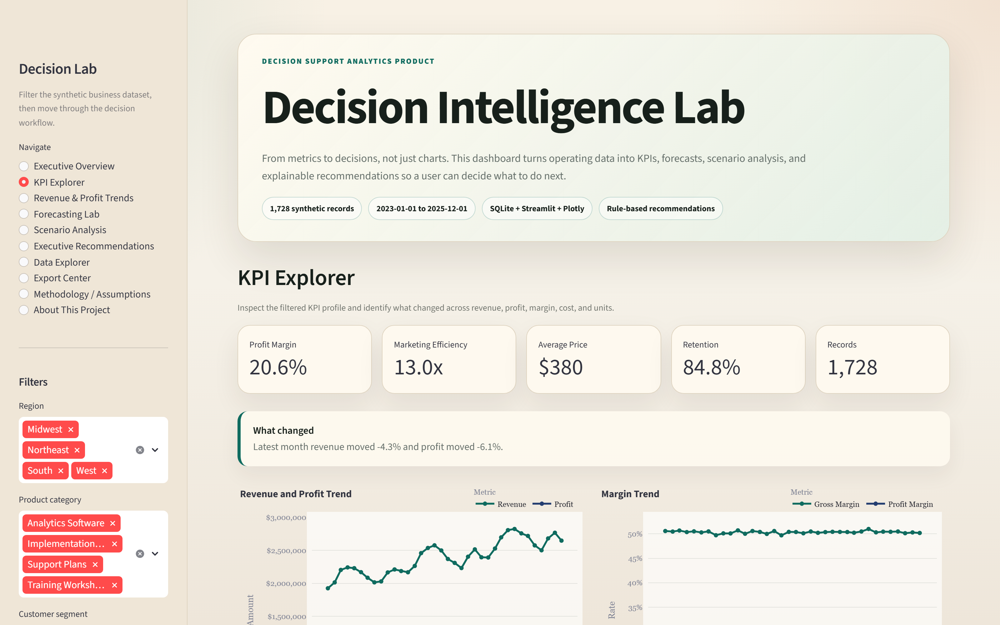
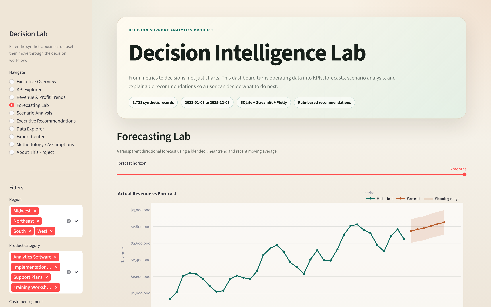
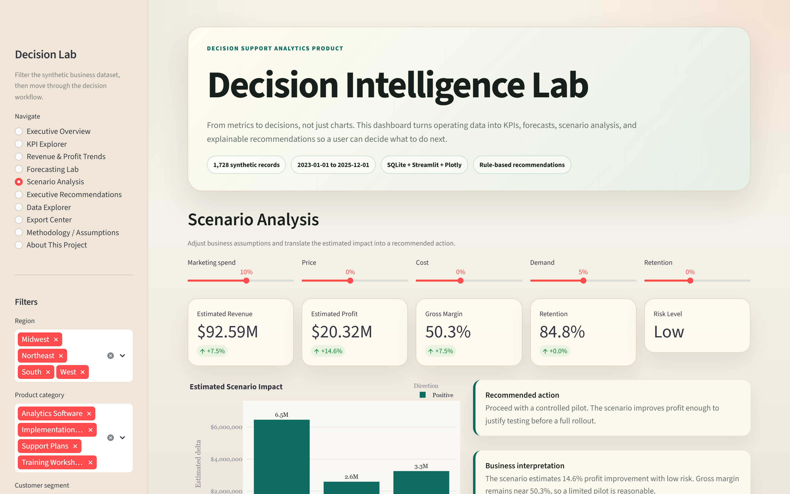
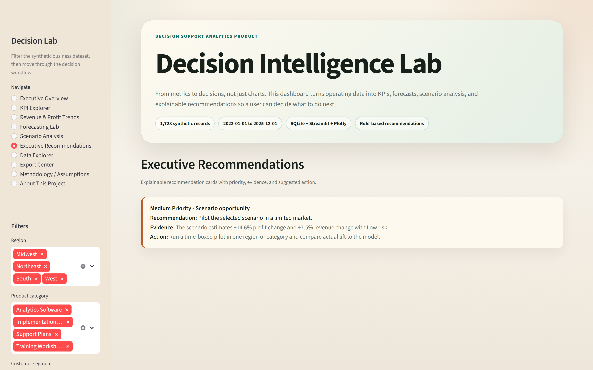
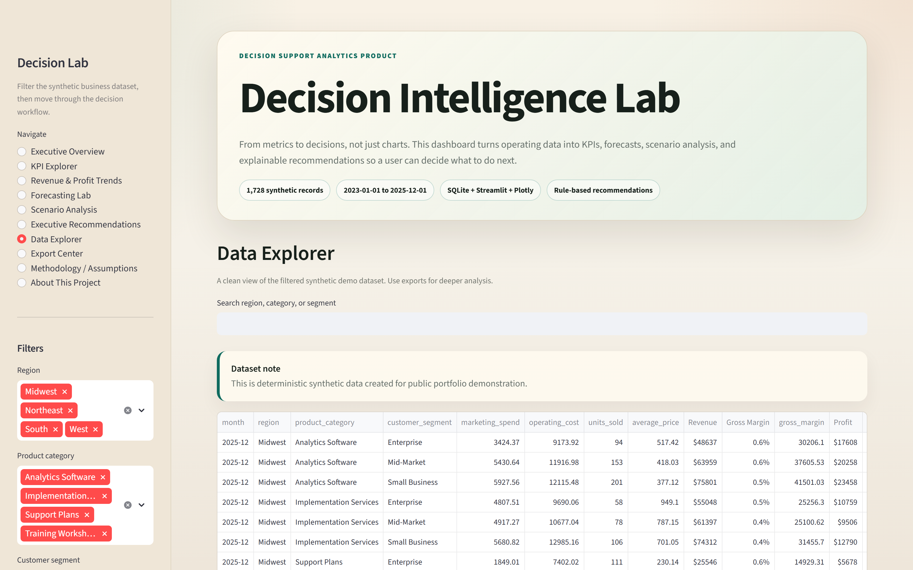

# Retail KPI & Forecasting Sandbox


Retail KPI & Forecasting Sandbox is a Streamlit analytics workflow that turns modeled retail operating data into KPIs, forecast ranges, scenario analysis, exports, and executive-style recommendations. The core idea is simple: do not just show charts, help answer what decision someone should make next.

Finding: The recommendation engine flags low-margin, high-volume segments as a risk; one example action is to improve product economics before pushing more volume.



## Demo

- Walkthrough video: [assets/demo/demo.webm](assets/demo/demo.webm)
- Optional MP4 export: `assets/demo/demo.mp4` is created when `ffmpeg` is installed.
- Screenshot set: [assets/demo](assets/demo)
- Validation notes: [docs/PORTFOLIO_PROOF.md](docs/PORTFOLIO_PROOF.md)

[](assets/demo/demo.webm)

## Screenshots













## Features

- Polished dashboard with sidebar navigation and product-style sections.
- SQLite-backed local analytics database.
- Deterministic modeled retail operating dataset with 1,728 records.
- Executive Overview with KPI cards, insight cards, and a recommended next action.
- KPI Explorer with date, region, product category, and customer segment filters.
- Revenue & Profit Trends with monthly financial, margin, cost, and unit views.
- Forecasting Lab using an explainable blended trend and moving-average forecast.
- Scenario Analysis for marketing, price, cost, demand, and retention assumptions.
- Executive Recommendations with High, Medium, and Low priority levels.
- Data Explorer with search, clean table formatting, and CSV download.
- Export Center for filtered data, KPIs, recommendations, scenario output, and Markdown summaries.
- Playwright media-capture workflow for README screenshots and demo video.
- pytest coverage for KPI, forecast, scenario, recommendation, and export logic.

## Business Problem

Many dashboards show what happened but do not help a business user decide what to do next. Retail KPI & Forecasting Sandbox demonstrates a practical analytics workflow for a small business or analyst team:

- Understand performance across revenue, profit, margin, cost, retention, and units.
- Identify strongest and weakest regions, categories, and customer segments.
- Forecast the near-term revenue direction without overclaiming precision.
- Test scenarios before changing marketing spend, prices, costs, or demand assumptions.
- Convert KPI and scenario signals into explainable executive recommendations.

## How It Works

```text
Modeled retail operating data
  -> SQLite database
  -> Streamlit data loader and filters
  -> KPI, forecast, scenario, and recommendation engines
  -> Dashboard, exports, screenshots, and demo video
```

The recommendation engine is rule-based by design. Each recommendation includes a priority, evidence, and suggested action so the logic is easy to explain in interviews and safe for review.

## Tech Stack

- Python
- Streamlit
- pandas
- NumPy
- SQLite
- Plotly
- Playwright
- pytest

## Setup: Mac/Linux

```bash
git clone https://github.com/tylerdobson/mvp-for-a-decision-intelligence-lab.git
cd mvp-for-a-decision-intelligence-lab
python -m venv .venv
source .venv/bin/activate
python -m pip install -r requirements.txt
python scripts/setup_database.py
streamlit run app.py
```

Open:

```text
http://localhost:8501
```

## Setup: Windows PowerShell

```powershell
git clone https://github.com/tylerdobson/mvp-for-a-decision-intelligence-lab.git
cd mvp-for-a-decision-intelligence-lab
python -m venv .venv
.\.venv\Scripts\Activate.ps1
python -m pip install -r requirements.txt
python scripts\setup_database.py
streamlit run app.py
```

Open:

```text
http://localhost:8501
```

## Run Tests

```bash
python -m pytest
python -m compileall -q app.py src scripts tests
```

## Regenerate Portfolio Media

Install Playwright's browser runtime once:

```bash
python -m playwright install chromium
```

Capture screenshots and video:

```bash
python scripts/capture_decision_lab_media.py
```

The script starts Streamlit locally, captures high-resolution screenshots, records a short walkthrough, writes `assets/demo/media_manifest.json`, and creates `demo.mp4` when `ffmpeg` is available. If `ffmpeg` is not installed, `demo.webm` remains the source video.

Generated media:

- `assets/demo/hero.png`
- `assets/demo/dashboard-overview.png`
- `assets/demo/kpi-explorer.png`
- `assets/demo/forecasting-lab.png`
- `assets/demo/scenario-analysis.png`
- `assets/demo/executive-recommendations.png`
- `assets/demo/data-explorer.png`
- `assets/demo/demo-poster.png`
- `assets/demo/demo.webm`
- `assets/demo/demo.mp4` when `ffmpeg` is available
- `assets/demo/linkedin-cover.png`
- `assets/demo/media_manifest.json`

## Project Structure

```text
decision-intelligence-lab/
|-- app.py
|-- requirements.txt
|-- AGENTS.md
|-- assets/
|   |-- demo/
|   `-- screenshots/
|-- data/
|   `-- sample_business_data.csv
|-- database/
|   `-- decision_lab.db
|-- docs/
|   |-- ARCHITECTURE.md
|   |-- DATA_DICTIONARY.md
|   |-- INTERVIEW_EXPLANATION.md
|   |-- METHODOLOGY.md
|   |-- PORTFOLIO_PROOF.md
|   |-- SETUP.md
|   `-- social/
|-- scripts/
|   |-- capture_decision_lab_media.py
|   |-- generate_sample_data.py
|   `-- setup_database.py
|-- sql/
|   |-- analysis_queries.sql
|   |-- create_tables.sql
|   `-- seed_data.sql
|-- src/
|   |-- charts.py
|   |-- config.py
|   |-- data_loader.py
|   |-- database.py
|   |-- forecasting.py
|   |-- kpi_engine.py
|   |-- recommendation_engine.py
|   |-- report_exporter.py
|   |-- scenario_engine.py
|   |-- ui_components.py
|   `-- utils.py
`-- tests/
```

## Assumptions And Limitations

- The dataset is modeled and deterministic for public demo use.
- Forecasts are directional planning estimates, not guaranteed predictions.
- Scenario results use transparent elasticity assumptions, not a causal model.
- Recommendations are rule-based and explainable.
- The app is designed for small business, student analyst, and public demo use cases.
- No external APIs, paid services, private data, or credentials are required.

## Project Value

This project demonstrates:

- End-to-end analytics product thinking.
- Python business-logic design with tests.
- SQLite data modeling and repeatable seed scripts.
- Streamlit dashboard design beyond raw dataframe display.
- Forecasting and scenario modeling with clear limitations.
- Explainable recommendation logic tied to visible metrics.
- Professional README, validation docs, media assets, and social launch copy.

## Future Improvements

- Add user CSV upload with validation and schema mapping.
- Add richer product-level scenario elasticity settings.
- Add exportable HTML or PDF executive reports.
- Add anomaly detection for cost, retention, and margin shifts.
- Add optional Docker setup for consistent deployment.
- Add a GitHub Actions workflow for automated tests and media refresh.

## License

MIT License. See [LICENSE](LICENSE).
